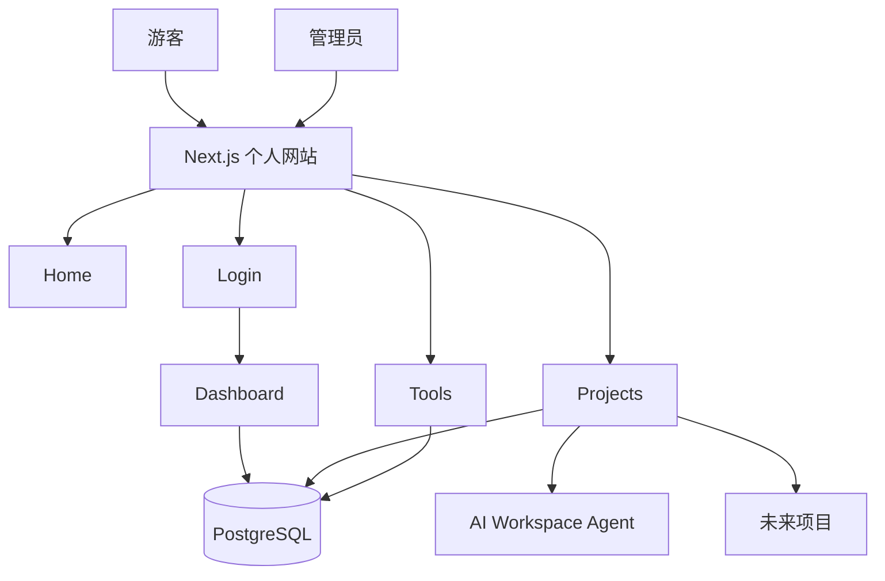

# 个人网站 + 项目中心 + 工具集：学习路线 v2

> 这不是“求职网站”，而是一个以自己长期使用为核心的个人网站。
>
> 核心目标：
>
> 1. 有一个自己的首页；
> 2. 能集中管理和访问自己的项目；
> 3. 有一个 Tools（工具集）页面，收藏常用网站和工具；
> 4. 游客可以浏览公开内容；
> 5. 自己登录后可以维护网站内容；
> 6. 后续可以继续扩展为个人知识库、导航站、项目控制台等。

---

# 一、网站定位

这个网站的定位不是“向别人证明我会什么”，而是：

```text
这是我自己的长期个人入口
```

你以后可以把它理解成自己的：

```text
个人主页
+
项目入口
+
工具导航站
+
个人管理后台
+
以后可扩展的个人数字空间
```

它可以公开给别人访问，但第一优先级是你自己用起来方便。

---

# 二、整体页面结构

建议顶部导航栏设计为：

```text
Home（首页）
Projects（项目）
Tools（工具集）
Notes（笔记，可选）
About（关于，可选）
Login（登录）
```

如果想更简洁：

```text
首页 | 项目 | 工具集 | 登录
```

---

# 三、首页该放什么

首页不需要强调：

- 求职定位
- 技术栈
- AI Application Developer（AI 应用开发者）
- 面试信息

首页可以更像你自己的入口页。

推荐结构：

## 3.1 顶部导航

```text
Logo / 网站名称

Home
Projects
Tools
Login
```

## 3.2 首页首屏

可以非常简单：

```text
欢迎来到我的个人网站

这里整理我的项目、常用工具和一些个人内容。
```

也可以增加：

```text
最近使用的项目
最近收藏的工具
常用入口
```

## 3.3 快捷入口

例如：

```text
常用项目
├── AI Workspace Agent
├── 第二个项目
└── 其他项目

常用工具
├── ChatGPT
├── GitHub
├── DeepL
├── JSON Formatter
└── 其他
```

---

# 四、Tools（工具集）

这是新版网站的重要模块。

路由：

```text
/tools
```

它可以理解为你自己的个人网址导航 + 工具收藏夹。

## 4.1 工具分类

例如：

```text
AI
开发
设计
图片
文档
学习
效率
文件
搜索
其他
```

## 4.2 每个工具保存什么

例如：

```text
名称
URL
图标
简介
分类
标签
是否常用
是否公开
备注
创建时间
```

例如一条数据：

```text
名称：JSON Formatter
URL：https://...
分类：开发
简介：在线格式化 JSON
标签：JSON / Debug
常用：是
公开：是
```

## 4.3 Tools 页面可以做到什么

游客：

```text
查看公开工具
点击跳转
分类浏览
搜索工具
```

你登录以后：

```text
添加工具
编辑工具
删除工具
修改分类
添加私人备注
设置公开 / 私有
设置常用工具
```

这就已经给“登录模式”找到了一个非常自然的用途。

---

# 五、Projects（项目中心）

路由：

```text
/projects
```

项目页不是一定要“把完整项目塞进个人网站代码里”。

这里需要区分两个概念：

1. 项目介绍
2. 项目本体

它们通常是两回事。

---

# 六、完整项目到底怎么放到个人网站

假设你已经有 AI Workspace Agent。

它本身是一个完整项目，可能有：

```text
React 前端
FastAPI 后端
数据库
RAG
Agent
Docker
```

它不应该简单复制进个人网站的一个目录然后完事。

更常见的做法是：

```text
AI Workspace Agent
↓
独立部署
↓
获得一个公网地址
```

例如：

```text
https://agent.example.com
```

然后你的个人网站：

```text
https://example.com/projects/ai-workspace-agent
```

是这个项目的介绍页面。

页面里有：

```text
项目名称
截图
简介
功能
说明
GitHub
打开项目
```

点击“打开项目”后跳转到：

```text
https://agent.example.com
```

这样就可以真正使用这个项目。

---

# 七、推荐的项目结构关系

例如你的主域名：

```text
example.com
```

个人网站：

```text
https://example.com
```

项目详情：

```text
https://example.com/projects/ai-workspace-agent
```

真正运行的 AI Workspace Agent：

```text
https://agent.example.com
```

以后第二个项目可以是：

```text
https://research.example.com
```

第三个项目可以是：

```text
https://tools.example.com
```

于是：

```text
example.com
│
├── /
│
├── /projects
│
├── /tools
│
└── /projects/ai-workspace-agent
      │
      └── 打开项目
             ↓
       agent.example.com
```

这种方式很清晰。

---

# 八、项目是不是一定要跳到新地址

不是。

主要有三种模式。

## 模式 A：独立部署 + 跳转

最推荐。

```text
个人网站
↓
项目详情
↓
点击“打开项目”
↓
跳到项目独立地址
```

优点：

- 简单
- 清晰
- 每个项目互不影响
- 容易部署
- 容易维护

## 模式 B：子域名

例如：

```text
www.example.com
agent.example.com
blog.example.com
```

这个其实也是独立部署，只是使用同一个主域名下面的不同子域名。

很适合后期。

## 模式 C：全部集成到个人网站内部

例如：

```text
example.com/apps/agent
```

这种方案也可以，但复杂得多。

因为你的个人网站和 AI 项目可能：

```text
技术栈不同
后端不同
依赖不同
数据库不同
部署方式不同
```

第一版不建议这样做。

---

# 九、Markdown / MDX 到底是什么

Markdown / MDX 不是用来“运行项目”的。

它主要是用来保存：

> 项目介绍内容。

例如 AI Workspace Agent 项目介绍，需要保存：

```text
项目名称
项目简介
截图
项目地址
GitHub 地址
项目说明
```

这些内容可以有多种保存方式。

---

# 十、方案 1：Markdown / MDX 保存项目介绍

例如：

```text
content/
└── projects/
    └── ai-workspace-agent.mdx
```

内容示例：

```md
---
title: AI Workspace Agent
demo: https://agent.example.com
github: https://github.com/xxx/xxx
---

# AI Workspace Agent

这是我的 AI 工作空间项目。

## 功能

- 知识库
- RAG
- Agent
- MCP
```

Next.js 读取这个文件：

```text
MDX 文件
↓
Next.js
↓
项目详情页面
```

它不是数据库。

它只是一个“项目介绍文件”。

---

# 十一、为什么一开始可以不用数据库

因为如果你的项目只有：

```text
3 个项目
10 个工具
```

而且只有你自己维护，

你完全可以把内容直接写在：

```text
代码文件
JSON 文件
Markdown
MDX
```

例如：

```ts
const projects = [
  {
    name: "AI Workspace Agent",
    url: "https://agent.example.com",
  },
];
```

这种情况下建立数据库可能反而增加复杂度。

---

# 十二、什么时候需要数据库

你的新版需求里：

> 我想登录后管理工具和项目。

这时数据库就开始变得有意义。

因为如果你希望：

```text
在网页后台点“新增工具”
↓
填写名字和网址
↓
点击保存
↓
立刻出现在 Tools 页面
```

那么数据必须保存到某个地方。

最适合的就是 Database（数据库）。

---

# 十三、数据库在这个网站里保存什么

建议保存：

## Tools 表

```text
id
name
url
description
category
tags
is_favorite
is_public
note
created_at
updated_at
```

## Projects 表

```text
id
name
slug
description
project_url
github_url
cover_image
is_public
sort_order
created_at
updated_at
```

后续可以增加 Notes 表：

```text
id
title
content
is_public
created_at
updated_at
```

---

# 十四、那么还需要 Markdown / MDX 吗

不一定。

新版方案有两条路。

## 路线 A

```text
Markdown / MDX
+
没有后台
```

优点：

- 简单
- 好学
- 代码清晰

缺点：

- 每次加项目都需要修改文件
- 修改后要重新部署网站

## 路线 B

```text
Database
+
管理员后台
```

优点：

- 登录网站即可增删改
- 不需要改代码
- 更符合你的“个人管理网站”需求

缺点：

- 要学习数据库
- 要做登录
- 要做权限
- 要做后台表单

---

# 十五、对你的项目我推荐什么

你的需求现在已经发生变化。

你不是只做：

```text
静态个人网站
```

而是：

```text
个人网站
+
Tools 工具管理
+
Projects 项目管理
+
管理员登录
```

因此更建议：

## 第一阶段先做静态版

先理解页面、路由、组件。

然后：

## 第二阶段加入数据库 + 管理员登录

这样学习曲线比较合理。

---

# 十六、游客模式和登录模式

你提到：

> 游客只能看不能改。

这是正确的。

但不一定需要让“所有游客注册账号”。

你的网站主要是自己使用，所以第一版最合理的是：

# Visitor + Admin

即：

```text
游客模式
+
管理员模式
```

而不是：

```text
游客
+
普通用户注册
+
管理员
```

---

# 十七、游客能做什么

Visitor（游客）：

```text
浏览首页
查看公开项目
打开公开项目
查看公开工具
点击工具链接
查看公开笔记
```

游客不能：

```text
新增工具
删除工具
修改工具
新增项目
删除项目
修改项目
查看私人内容
进入管理后台
```

---

# 十八、管理员模式有什么用

你自己登录后：

```text
/dashboard
```

进入个人管理后台。

管理员可以：

## Tools 管理

```text
新增工具
编辑工具
删除工具
分类
搜索
添加备注
设置常用
设置公开 / 私有
```

## Projects 管理

```text
新增项目
修改项目
修改项目地址
修改 GitHub
修改项目介绍
上传封面
设置公开 / 私有
调整排序
```

## 个人数据

以后还可以：

```text
私人链接
私人笔记
个人快捷入口
API 状态
服务器入口
常用命令
```

这才是真正符合你需求的登录功能。

---

# 十九、需不需要普通用户登录

第一版：

# 不需要。

因为别人登录以后能做什么，目前没有明确需求。

如果只是让别人查看网站，根本没必要注册登录。

增加用户系统还会带来：

```text
注册
邮箱验证
找回密码
用户权限
数据库
账号安全
隐私
垃圾账号
```

完全没有必要。

---

# 二十、以后什么时候增加普通用户

只有出现明确需求时。

比如未来你希望用户：

```text
收藏自己的工具
保存项目
写自己的笔记
评论
使用个人 AI 配额
同步设置
```

才增加 User Account（普通用户账户）。

否则：

```text
Visitor + Admin
```

已经足够。

---

# 二十一、权限模型

建议：

```text
Visitor
│
├── READ public projects
├── READ public tools
└── READ public notes

Admin
│
├── READ
├── CREATE
├── UPDATE
├── DELETE
└── READ private content
```

这里：

- READ = 查看
- CREATE = 新增
- UPDATE = 修改
- DELETE = 删除

也就是 CRUD（增删改查）。

---

# 二十二、推荐最终技术架构

第一阶段：

```text
Browser
↓
Next.js
↓
静态项目数据
```

第二阶段：

```text
Browser
↓
Next.js
├── Public Pages
└── Admin Dashboard
        ↓
     Database
```

以后如果需要：

```text
Next.js
↓
API
↓
PostgreSQL
```

---

# 二十三、推荐技术栈

## 网站主体

```text
Next.js（React 全栈框架）
TypeScript（类型化 JavaScript）
Tailwind CSS（原子化 CSS 框架）
```

## 数据库

学习阶段可以先：

```text
SQLite（轻量数据库）
```

或者直接：

```text
PostgreSQL（关系型数据库）
```

如果以后上线长期使用，更倾向 PostgreSQL。

## ORM

后续可以学习：

```text
Prisma（数据库 ORM 工具）
```

ORM（对象关系映射）可以让 TypeScript 更方便操作数据库。

## 登录

后续可以考虑：

```text
Auth.js（身份认证库）
```

但学习时应该先理解：

```text
Session（会话）
Cookie（浏览器 Cookie）
Authentication（身份认证）
Authorization（权限控制）
```

再使用认证框架。

---

# 二十四、推荐网站导航

最终：

```text
Home
Projects
Tools
Notes（可选）
About（可选）
```

右上角：

```text
登录
```

登录后：

```text
头像 / Admin
```

点击进入：

```text
Dashboard
```

---

# 二十五、Dashboard（管理后台）

建议：

```text
/dashboard
│
├── Overview
├── Projects
├── Tools
├── Notes
└── Settings
```

---

# 二十六、Tools 管理后台

```text
/dashboard/tools
```

功能：

```text
工具列表
搜索
分类筛选
新增
编辑
删除
公开 / 私有
常用 / 普通
```

---

# 二十七、Projects 管理后台

```text
/dashboard/projects
```

功能：

```text
项目列表
新增项目
编辑项目
项目地址
GitHub
简介
截图
封面
是否公开
排序
```

---

# 二十八、项目独立部署流程

以后每完成一个项目：

```text
项目代码
↓
GitHub
↓
部署
↓
获得项目 URL
↓
进入个人网站后台
↓
新增项目
↓
填写：
名称
简介
项目 URL
GitHub
截图
↓
保存
```

然后：

```text
个人网站 Projects 页面
↓
自动出现新项目
```

这就是未来最顺手的工作流。

---

# 二十九、项目点击后的体验

建议项目卡片有两个按钮。

```text
查看详情
```

进入：

```text
/projects/xxx
```

看到项目介绍。

另外：

```text
打开项目
```

进入项目真正部署地址。

这是最清晰的设计。

---

# 三十、工具点击后的体验

Tools 页面：

```text
工具卡片
│
├── 图标
├── 名称
├── 简介
├── 分类
└── 打开
```

点击：

```text
打开
↓
新标签页
↓
外部工具网站
```

---

# 三十一、公开与私有

这是这个网站后续非常实用的功能。

每一条 Tool / Project / Note 都可以有：

```text
is_public
```

例如：

```text
true
```

游客可见。

```text
false
```

只有你登录后可见。

于是 Tools 页面甚至可以变成：

```text
公开工具
+
自己的私人收藏夹
```

---

# 三十二、网站最终可以演变成什么

初期：

```text
个人网站
+
项目
+
工具集
```

以后：

```text
个人 Dashboard
├── 项目
├── 工具
├── 笔记
├── 私人链接
├── AI
├── 服务器
└── 自动化
```

甚至可以继续连接：

```text
MCP
Agent
GitHub
自己的 API
```

它会逐渐变成你自己的 Personal Digital Workspace（个人数字工作空间）。

---

# 三十三、新版学习阶段

重新分为：

## Phase 1：网站基础

Day 1～5

## Phase 2：项目 + 工具集

Day 6～8

## Phase 3：数据库 + 登录 + 后台

Day 9～14

## Phase 4：上线

Day 15～16

---

# Day 1：确定架构 + Next.js 基础

学习：

- Next.js 是什么
- React 与 Next.js 的关系
- App Router（应用路由）
- `app/`
- `page.tsx`
- `layout.tsx`
- `components/`

任务：

```text
创建项目
启动网站
建立导航
```

页面：

```text
Home
Projects
Tools
```

验收：

```text
三个页面都能访问
```

---

# Day 2：TypeScript + Component

学习：

- TypeScript
- Component（组件）
- Props（组件参数）
- Interface（接口类型）

任务：

建立：

```text
Header
Footer
Card
```

验收：

能解释为什么拆组件。

---

# Day 3：首页

制作：

```text
首页
快捷入口
最近项目
常用工具
```

重点不是复杂动画，而是：

```text
简单
清楚
自己用起来方便
```

---

# Day 4：响应式 + UI

学习：

- Tailwind CSS
- Flexbox
- Grid
- Responsive Design

验收：

```text
电脑
手机
```

都能正常使用。

---

# Day 5：基础数据模型

先不用数据库。

建立：

```text
projects.ts
tools.ts
```

理解：

```text
数据
↓
组件
↓
页面
```

这是后面数据库的基础。

---

# Day 6：Projects

实现：

```text
/projects
```

项目卡片包含：

```text
名称
简介
封面
详情
打开项目
```

加入：

```text
AI Workspace Agent
```

但项目本体仍然独立。

---

# Day 7：Project Detail

实现：

```text
/projects/[slug]
```

理解 Dynamic Route（动态路由）。

详情页：

```text
项目说明
截图
GitHub
打开项目
```

---

# Day 8：Tools

实现：

```text
/tools
```

功能：

```text
工具卡片
分类
搜索
跳转
```

先用本地 TypeScript 数据。

---

# Day 9：数据库基础

学习：

```text
Database
Table
Row
Column
Primary Key
CRUD
```

把：

```text
tools.ts
```

逐渐迁移到数据库。

---

# Day 10：Prisma + Database

学习：

```text
Prisma
Schema
Migration
Query
```

建立：

```text
Tool
Project
```

数据表。

---

# Day 11：管理员登录

学习：

```text
Authentication
Session
Cookie
Password
```

只做：

```text
Admin Login
```

不做普通用户注册。

---

# Day 12：Dashboard

实现：

```text
/dashboard
```

必须登录才能进入。

游客访问：

```text
/dashboard
```

应跳到：

```text
/login
```

---

# Day 13：Tools 后台管理

实现 CRUD：

```text
Create
Read
Update
Delete
```

也就是：

```text
增
查
改
删
```

你可以直接在网页：

```text
新增工具
编辑工具
删除工具
```

---

# Day 14：Projects 后台管理 + 公开私有

实现：

```text
新增项目
编辑项目
删除项目
public / private
排序
```

游客：

```text
只能查看 public
```

管理员：

```text
public + private
```

---

# Day 15：部署个人网站

学习：

- Build（构建）
- Deployment（部署）
- Environment Variables（环境变量）
- Production（生产环境）

部署网站。

---

# Day 16：域名 + 最终验收

学习：

- Domain（域名）
- DNS（域名解析）
- HTTPS（安全访问）

最终检查：

```text
Home
Projects
Tools
Login
Dashboard
Database
权限
```

---

# 三十四、命令学习原则

以后出现命令，例如：

```powershell
npm run dev
```

必须理解：

- `npm`：Node Package Manager（Node 包管理器）
- `run`：运行 `package.json` 中定义的脚本
- `dev`：development（开发环境）脚本名称

而不是只复制。

---

# 三十五、第一版不做什么

为了避免项目无限扩大，第一版先不做：

```text
普通用户注册
评论
点赞
社交功能
复杂权限
多人协作
实时聊天
支付
复杂 CMS
```

---

# 三十六、第一版必须完成什么

```text
Home
Projects
Project Detail
Tools
Admin Login
Dashboard
Tools CRUD
Projects CRUD
Public / Private
Responsive Design
Database
Deployment
```

---

# 三十七、最终架构



---

# 三十八、最重要的设计结论

## 项目本体

```text
独立开发
独立 GitHub
独立部署
独立 URL
```

## 个人网站

负责：

```text
集中展示
集中访问
集中管理
```

## Tools

```text
外部网站收藏
+
登录后管理
```

## 登录

第一版不是给别人注册，而是管理员登录，主要给你自己维护网站使用。

## 数据库

静态展示阶段可以不用。

一旦要实现：

```text
网页登录
+
在线新增 / 修改 / 删除
```

就非常适合使用数据库。

---

# 三十九、接下来怎么学习

不要一次生成完整项目。

采用：

```text
讲原理
↓
当天任务
↓
你先思考
↓
Codex 协助实现
↓
运行
↓
检查代码
↓
Playwright MCP 测试
↓
验收
↓
进入下一天
```

下一步正式开始：

# Day 1：个人网站架构 + Next.js 基础

Day 1 不追求漂亮。

目标只有：

```text
真正理解项目从哪里开始，
并建立 Home / Projects / Tools 三个最基础页面。
```
